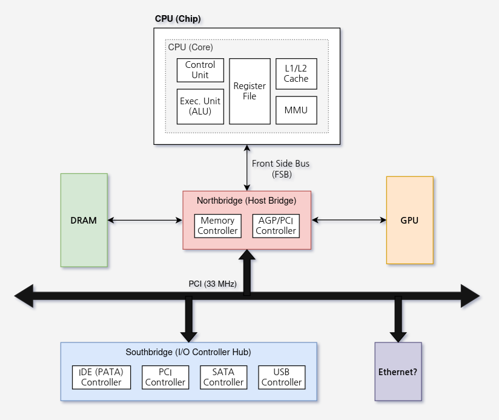
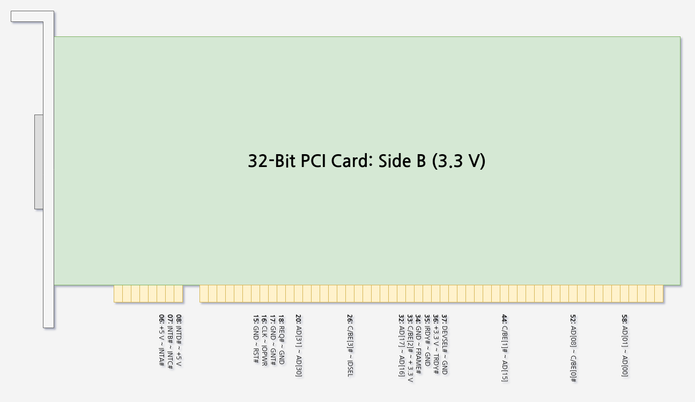
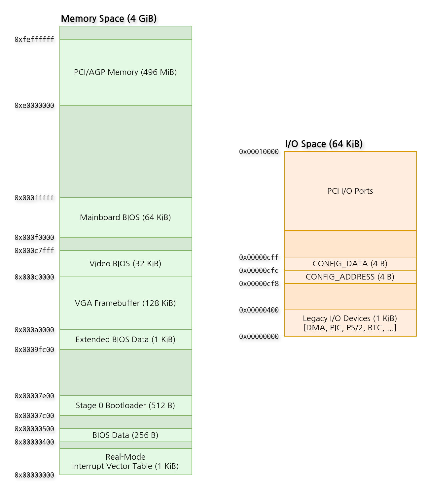

<!-- https://www.youtube.com/watch?v=TgjOrq39J94 -->

## PCI (Peripheral Component Interface)

PCI란 1990년대 초에 발표된, 메인 보드에 연결된 NIC, 사운드 카드, 하드 디스크 등의 주변 장치를 CPU에 연결하기 위한 버스 규격이다.  

PCI가 등장하기 전까지는 ISA (Industry Standard Architecture)와 VLB (VESA Local Bus)가 주로 사용되었으나, 컴퓨터의 성능이 향상되면서 기존 버스 규격의 낮은 대역폭, 전기적 불안정성과 메인보드 설계의 어려움 같은 문제점이 지적되었다.

PCI는 이러한 문제점을 모두 해결하며, 당시 컴퓨터의 주류 버스 규격으로 자리잡게 되었다.

<br>

## PCI-based Systems



2008년 이후부터는 Northbridge와 Southbridge 일부 기능이 CPU에 모두 들어있는 것이 일반적이지만, 예전에는 이러한 기능이 CPU가 아닌 메인보드 칩셋으로 구현되어 있었다.

PCI 기반의 시스템은 PCI 슬롯에 연결된 모든 주변 장치들의 버스가 하나로 묶여있는 '공유 버스' 형태로 구성되어 있기 때문에, 여러 개의 주변 장치가 동시에 CPU나 RAM한테 전기 신호를 보내는 '버스 경합 (bus contention)'이 발생할 경우 데이터 오염이나 하드웨어 손상을 야기할 수 있다. '버스 경합'을 막기 위해, Northbridge에서는 CPU와 PCI 장치 사이의 통신을 중재하는 하드웨어 회로를 두고 있는데, 이를 PCI Arbiter라고 한다.

PCI 장치는 하나 이상의 기능 (function)을 가질 수 있는데, '그래픽 연산'과 'HDMI 오디오'라는 두 가지 기능을 지원하는 NVIDIA 사의 그래픽 카드를 생각해보면 이해가 쉬울 것이다. CPU와 마찬가지로, 주변 장치의 각 기능은 PCI Arbiter에게 '공유 버스'를 사용하기 위한 권한을 요청 (`REQ#`)하고 PCI Arbiter가 이 요청을 받아들이면 (`GNT#`) '공유 버스'를 독점적으로 사용할 수 있는데, 이처럼 '공유 버스'의 사용 권한을 요청하는 CPU 또는 주변 장치를 Bus Master라고 한다.

<br>

## PCI Bus Cycle



(추가 예정)

<br>

## PCI Interrupt Handling

(추가 예정)

<br>

## PCI Error Handling

(추가 예정)

---

## PCI Transaction Models

PCI 장치가 CPU, RAM, 그리고 다른 PCI 장치와 데이터를 주고 받을 수 있는 방법에는 총 3가지가 있다.

<br> 

### Programmed I/O

Programmed I/O (PIO)는 하드웨어 제조 및 설계 비용이 매우 비쌌던 90년대 초중반까지 주로 사용되었으며, PCI 장치와 데이터를 주고 받을 때 수행해야 하는 대부분의 작업을 CPU가 처리하는 방식이다.

그 당시에는 CPU 없이 메모리의 데이터를 직접 접근하는 하드웨어 회로 (DMA 컨트롤러)를 PCI 장치마다 하나씩 추가하는 게 제조사 입장에서 부담스럽기도 했고, PIO를 이용하면 Southbridge에 연결된 PCI 장치의 I/O 포트로 명령어 몇 개만 보내고 받는 간단한 코드로 PCI 장치를 제어할 수 있었기 때문에, PIO는 가성비가 매우 좋은 방식이었다.

예를 들어, x86 CPU가 PCI 장치에서 데이터를 읽는다고 하면:

```asm
pci_read:
    ; NOTE: `dx`에는 PCI 장치에 대한 I/O 포트의 16비트 Base Address가 저장되어 있음

    add dx, 0x07   ; NOTE: PCI 장치의 명령어/상태 레지스터는 `BASE + 7`

.bw_rdy:
    in al, dx      ; 1. CPU가 PCI 장치의 명령어/상태 레지스터를 읽는다.

    test al, 0x80  ; 2. PCI 장치의 'BSY' 비트를 확인한다.

    jne .bw_rdy    ; 3. PCI 장치가 '읽기' 준비가 될 때까지 ('BSY' 비트가 Clear될 때까지) 기다린다.

.send_cmd:
    mov al, 0x01   ; NOTE: `0x01`은 '읽기', '0x02'는 '쓰기' 명령이라 가정하자.

    out dx, al     ; 4. PCI 장치의 명령어/상태 레지스터로 '읽기' 명령을 보낸다.

.bw_cmd:
    in al, dx

    test al, 0x80

    jne .bw_cmd    ; 5. PCI 장치가 '읽기' 명령을 처리할 때까지 다시 기다린다.

.ready:
    nop            ; 6. '읽기' 준비가 끝나면 `dx`를 데이터 레지스터 주소로 설정하고, 
                   ;    `in`으로 데이터를 읽는다.
```

반대로, CPU가 PCI 장치에 데이터를 쓴다고 하면:

```asm
pci_write:
    ; NOTE: `dx`에는 PCI 장치에 대한 I/O 포트의 16비트 Base Address가 저장되어 있음

    add dx, 0x07   ; NOTE: PCI 장치의 명령어/상태 레지스터는 `BASE + 7`

.bw_rdy:
    in al, dx      ; 1. CPU가 PCI 장치의 명령어/상태 레지스터를 읽는다.

    test al, 0x80  ; 2. PCI 장치의 'BSY' 비트를 확인한다.

    jne .bw_rdy    ; 3. PCI 장치가 '쓰기' 준비가 될 때까지 ('BSY' 비트가 Clear될 때까지) 기다린다.

.send_cmd:
    mov al, 0x02   ; NOTE: `0x01`은 '읽기', '0x02'는 '쓰기' 명령이라 가정하자.
    
    out dx, al     ; 4. PCI 장치의 명령어/상태 레지스터로 '쓰기' 명령을 보낸다.

.bw_cmd:
    in al, dx

    test al, 0x80

    jne .bw_cmd    ; 5. PCI 장치가 '쓰기' 명령을 처리할 때까지 다시 기다린다.

.ready:
    nop            ; 6. '쓰기' 준비가 끝나면 `dx`를 데이터 레지스터 주소로 설정하고, 
                   ;    `out`으로 데이터를 쓴다.
```

Intel 80386/80486 CPU를 주로 사용하던 90년대 초반까지만 해도, CPU의 클럭 속도는 16 - 50 MHz (내부 대역폭은 64 - 200 MB/s) 정도로 낮아 PCI 버스의 클럭 속도인 33 - 66 MHz (버스 대역폭 133 MB/s)과 큰 차이가 나지 않았지만, Intel Pentium 시리즈가 등장하면서 CPU의 클럭 속도는 100 MHz를 넘어가게 된다. 그런데 CPU가 데이터를 다 받을 때까지 PCI 장치를 계속 확인 (polling)해야 하는 PIO 방식은 CPU의 발목을 잡았고, 거기에 더해 DMA 컨트롤러의 가격까지 저렴해지면서 PIO는 구시대의 유물로 전락하였다.

<br> 

### Direct Memory Access (DMA)

DMA는 메인보드 (Southbridge)의 공용 DMA 컨트롤러 또는 PCI 장치의 DMA 엔진을 통해, PCI 장치가 CPU를 거치지 않고 메인 메모리와 데이터를 주고 받는 방법이다.

(추가 예정)

<br> 

### Peer-to-Peer (P2P)

(추가 예정)

<br>

---

## PCI Address Spaces



CPU는 I/O Space, Configuration Space, 그리고 Memory Space라는 3가지의 주소 공간을 이용해 PCI 장치를 제어한다.

<br>

### I/O Space

**I/O Space란 x86 CPU의 `in`, `out` 명령어를 통해서만 접근할 수 있는 64 KiB의 주소 공간으로, Southbridge에 연결된 주변 장치들 내의 레지스터를 가리킨다.**

> 하드웨어 규격이 AT에서 ATX로, 버스 규격이 ISA에서 PCI로 전환되던 90년대 중후반에는 컴퓨터의 부팅 과정이 다음과 같았다:
> 
> 1. 파워 서플라이 (Power Supply Unit, PSU)는 컴퓨터가 꺼져 있어도 AC 전원을 받아 메인 보드에 `+5 VSB`의 전압을 지속적으로 공급하는데, 본체의 전원 버튼을 `10-100 ms` 동안 누르면 메인 보드는 파워 서플라이의 `PS_​ON#` (Active-Low) 핀에 걸리는 전압을 `+5 V`에서 `0 V`로 내린 상태로 유지한다.
> 2. 파워 서플라이는 `PS_​ON#`의 신호를 받아 `+12VDC`, `+5VDC`, `+3.3VDC` 등의 DC 출력 레일을 켜고, 메인 보드는 출력 레일의 전압이 안정될 때까지 CPU의 `RESET` 핀 전압을 `+5 V`로 올려 CPU를 계속 초기화시킨다.
> 3. 모든 DC 출력 레일의 전압이 안정되면, 파워 서플라이는 메인 보드의 Super I/O (SIO) 칩에 `PWR_OK` 신호를 보내 이 사실을 알린다.
> 4. 메인 보드는 CPU의 `RESET` 핀 전압을 `0 V`로 내리는데, 이때 CPU는 범용 레지스터 (`AX`, `BX`, ...), 상태 레지스터 (`FLAGS`), 프로그램 카운터 (`IP`)와 제어 레지스터 (`CR0`) 등이 모두 기본값으로 초기화된 상태이다.
> 5. CPU는 Reset Vector에 저장된 'Far Jump' 명령어를 실행하여, 1 MiB 이하의 메모리 영역에 매핑된 BIOS 코드의 첫 번째 명령어로 이동한다.
> 6. BIOS는 Power-On Self Test (POST)를 시작하여, 아래 사항을 점검한다:
>     - 자기 자신 (BIOS 코드)의 체크섬 이상 여부
>     - CPU와 RAM의 정상 동작 여부
>     - Southbridge에 어떤 'Legacy' 주변 장치가 연결되어 있는가?
>     - 메인 보드의 PCI 슬롯에 어떤 PCI 장치가 꽂혀 있는가?
> 7. BIOS는 하드 디스크의 첫 번째 섹터를 읽고, 운영 체제의 Stage 0 Bootloader를 실행한다.

<br>

이때, POST에서 메인 보드의 어느 PCI 슬롯에 무슨 장치가 꽂혀 있는지 확인하는 과정을 PCI Enumeration이라 한다:

1. CPU는 `out` 명령어를 이용하여, PCI 버스 번호와 그 버스의 슬롯 번호를 I/O 포트 중 `CONFIG_ADDRESS` (`0xCF8`)로 보낸다.
2. CPU가 `in` 명령어를 이용해 `CONFIG_DATA` (`0xCFC`)를 읽는 그 순간, Northbridge는 이 요청을 가로채서 해당 버스와 슬롯에 연결된 PCI 장치의 `IDSEL` 핀에 신호를 보낸다.
3. PCI 장치가 꽂혀 있다면 이 장치는 `DEVSEL#` 핀을 통해 Northbridge에게 자신이 살아 있음을 알린다.
4. Northbridge는 PCI 장치의 자기소개서 (Configuration Space) 중 일부 (4 B)를 CPU의 `AX` 레지스터에 Write한다.

<br>

### Configuration Space

<br>

### Memory Space

<br>

## PCI Enumeration

<br>

---

## 참고 자료

- M. Jackson and R. Budruk, *PCI Express Technology: Comprehensive Guide to Generations 1.x, 2.x and 3.0*, 1st ed., MindShare, Inc., Sep. 2012.
- R. E. Bryant and D. R. O'Hallaron, *Computer Systems: A Programmer's Perspective*, 3rd ed., Pearson Education Ltd. 2016.